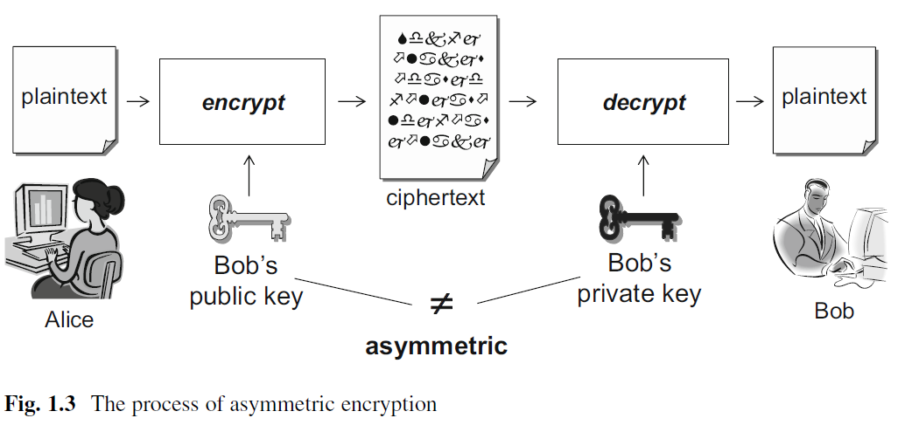
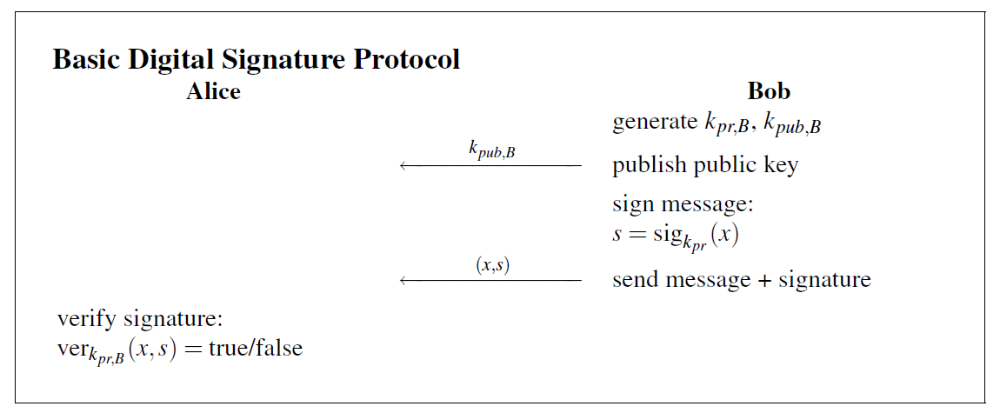
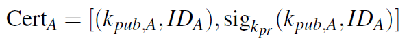

# Overview

PKI is security infrastructure which provides all necessary services to implement public-key cryptography and thus enables secure communication using public-key cryptography on open networks.

# Main concepts

## Public-key cryptography

The main idea of public-key cryptography is to use different keys for encryption and decryption. The encryption key is made public and thus also called public key, while the decryption key is kept private and thus also called private key.

Two important requirements on public-key cryptography are that the encryption function must be a one-way function and that it is infeasible to derive one key from another.

Public-key cryptosystems use the public key to encrypt messages. The encrypted messages can only be decrypted with the corresponding private keys. Thus, even if the messages are intercepted, the interceptors still cannot know the original messages unless they know the private keys. The main processing flow is as follows [1]:

The first and most widely used public-key cryptosystem is RSA, which is named after its inventors Ron Rivest, Adi Shamir, and Leonard Adleman.

## Digital signatures

Digital signatures are analogous to hand-written signatures in that they are used to prove the authenticity of a message. The main idea is that then sender uses its private key (which is only known to the sender) to sign the message and the receiver will use the sender's public key to verify the signature. The process is as follows [2]:

It is important to note that the signature must always be associated with the message from which the signature is created.

The most widely used digital signature is the RSA signature scheme.

## Digital certificates

Digital certificates are used to prove the authenticity of public keys by binding public keys to their owners. Without certificates, public-key cryptography can easily be the victim of the man-in-the-middle attacks. For example, if Oscar somehow replaces Alice's public key by his, then every messages encrypted with the compromised Alice's public key can be decrypted by Oscar when he intercepts the messages.

In its simplest form, a certificate looks like this [2]:

The certificate contains the signature which must be signed by a certificate authority. This signature guarantees the integrity of the certificate, which provides the information about the public key and its owner.

One commonly used certificate standard is X.509.

## Certificate authority (CA)

Certificate authorities are trusted third-parties who are responsible for managing the certificates, e.g., issuing and revoking certificates.

# Main services

The main services provided by PKI include:

- Confidentiality
  - Data is protected from unauthorized entities.
  - By public key encryption and private key decryption

- Data integrity
  - Data could not be changed by unauthorized entities.
  - By digital signatures

- Authentication
  - Involved entities must prove who they are
  - By signing on authentication information

- Data origin authenticity
  - The origin of the data must be reliable.
  - By digital certificates and signatures

- Non-repudiation
  - Prevents involved entities from denying that they have performed some actions, e.g., some harmful actions.
  - By digital signatures

# References

[1] [Introduction to Public Key Infrastructures](http://www.amazon.com/Introduction-Public-Infrastructures-Johannes-Buchmann/dp/3642406564/ref=sr_1_1?ie=UTF8&qid=1456768775&sr=8-1&keywords=introduction+to+pki)

[2] [Understanding Cryptography: A Textbook for Students and Practitioners](http://www.amazon.com/Understanding-Cryptography-Textbook-Students-Practitioners/dp/3642041000/ref=sr_1_1?s=books&ie=UTF8&qid=1456768821&sr=1-1&keywords=understanding+cryptography+a+textbook+for+students+and+practitioners)

[3] [Understanding PKI: Concepts, Standards, and Deployment Considerations](http://www.amazon.com/Understanding-PKI-Standards-Deployment-Considerations/dp/0321743091/ref=sr_1_1?ie=UTF8&qid=1456768907&sr=8-1&keywords=understanding+pki)
